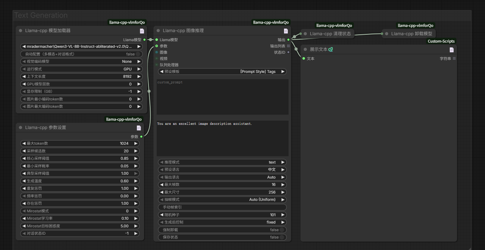
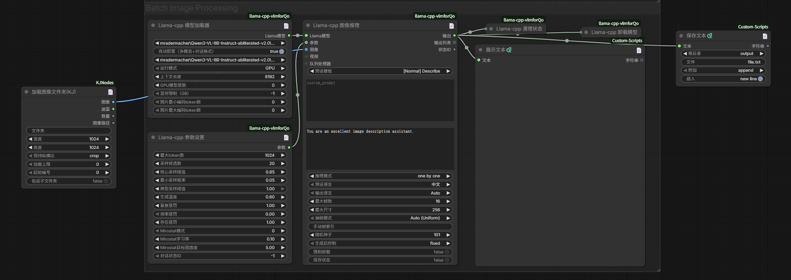
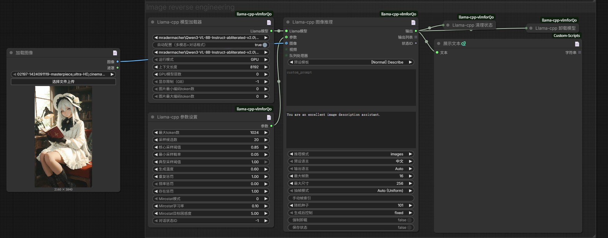
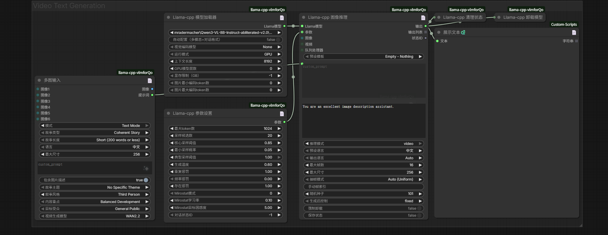
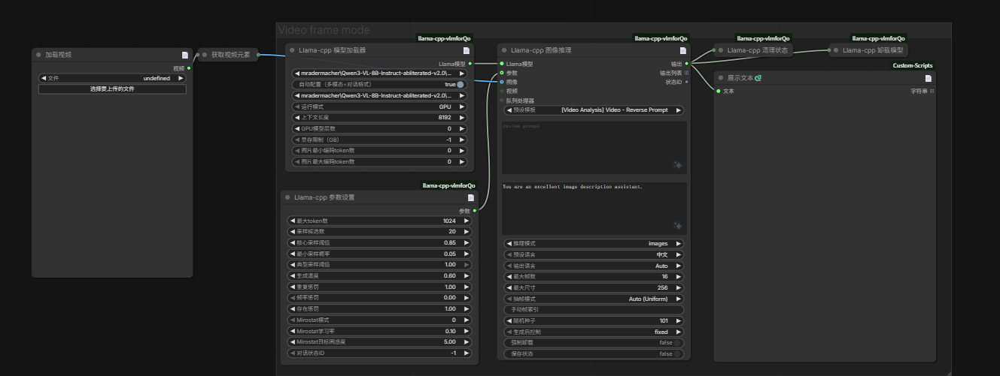
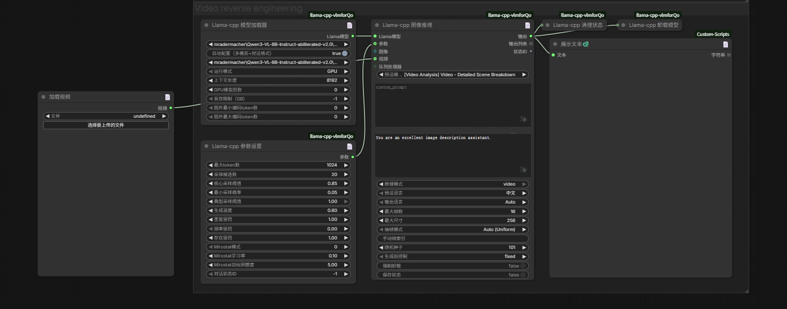
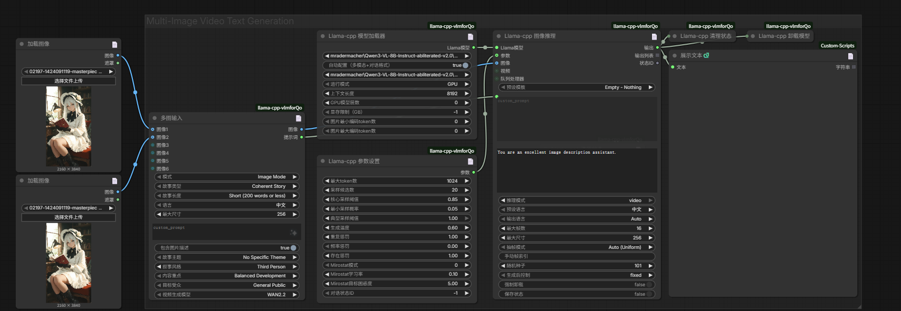

# ComfyUI-llama-cpp-vlmforQo

在ComfyUI中基于llama.cpp原生运行LLM/VLM模型，支持多模态推理、视觉语言理解和各种AI任务。

**[📃English](./README.md)**

## 项目简介

ComfyUI-llama-cpp-vlmforQo是一款功能全面、性能优化的ComfyUI插件，基于ComfyUI-llama-cpp-vlm插件进行深度重构与增强，专注于提供本地化、高效的多模态AI推理能力，目前以支持40余种VLM模型，200多种LLM模型，插件提供了丰富的参数调整选项，用户可以根据自己的需求选择不同的模型和参数配置，以实现最佳的推理效果。

相较于同类插件，本项目在以下方面实现了显著突破：
- **更全面的多模态支持**：不仅支持文本和图片，还新增视频输入与分析能力
- **更智能的硬件适配**：基于llama.cpp技术，实现从高端到低端设备的智能参数调优
- **更丰富的模型生态**：支持多种主流VLM/LLM模型，包括最新发布的专业AI模型，并实现动态支持功能
- **更优化的推理性能**：重构模型加载与推理流程，显著提升运行效率
- **更专业的提示词系统**：内置丰富的预设模板，覆盖从基础描述到专业模型优化的全场景需求

> 注：与ComfyUI-llama-cpp-vlm及分支插件不兼容（部分版本更新会修改文件结构目录，安装旧版插件的建议删除后再安装新版插件，请勿覆盖或安装多个相同的插件，以免发生运行错误）

## 核心功能

- **多模态全支持**：处理文本、图片和视频输入，实现跨模态理解与生成
- **广泛模型兼容**：支持多种主流VLM/LLM模型，包括最新发布的专业AI模型
- **智能硬件适配**：根据显存大小自动调整参数，实现硬件性能最大化
- **高效推理引擎**：优化的模型加载和推理流程，显著提升运行速度
- **专业提示词模板**：内置多种场景化提示词模板，包括专业AI模型专属优化模板
- **灵活参数控制**：详细的推理参数设置，满足不同场景的定制化需求
- **视频处理能力**：新增视频输入支持，实现视频内容分析与反推
- **CPU/GPU模式**：自由切换运行模式，适配不同硬件配置
- **硬件检测优化**：自动检测硬件性能并推荐最佳参数配置

## 中文翻译
将zh-CN文件放入翻译插件(ComfyUI-Chinese-Translation/AIGODLIKE-ComfyUI-Translation/ComfyUI-DD-Translation对)应的文件夹内覆盖即可,推荐安装ComfyUI-Chinese-Translation插件，汉化更全面，翻译更新速度更快更全。


## 更新日志
#### 2026-02-23
- 新增多图输入节点（Multi-Image Input），支持以下功能：
  - 双模式工作：图像模式分析多张图片并创作故事，文本模式通过选项设置生成提示词
  - 多图输入支持：支持1-6张图片输入，自动预处理和编码
  - 丰富的内容创作类型：支持连贯故事、分镜描述、场景分析、角色发展、情感递进、创意写作、剧本创作、广告文案、产品介绍、教育内容等10种类型
  - 灵活的长度控制：支持简短（200字）、中等（400字）、详细（600字）、完整（1000字）四种长度选项
  - 多语言支持：支持中文和英文输出
  - 丰富的主题选择：支持冒险、浪漫、悬疑、科幻、奇幻、日常生活、历史、未来科技、商业营销、教育科普、娱乐搞笑等12种主题
  - 多样化叙事风格：支持第一人称、第三人称、全知视角、多视角切换等4种风格
  - 内容重点控制：支持平衡发展、强调情节、强调角色、强调情感、强调视觉、强调对话等6种重点
  - 目标受众定制：支持普通大众、青少年、儿童、专业人士、特定群体等5种受众
  - 视频模型优化：针对WAN2.2、LTX2、General Video、Custom等不同视频生成模型优化提示词格式
  - 自定义提示词：支持添加自定义提示词指导内容创作
  - 图像描述控制：可选择是否在故事前包含每张图像的描述
- 新增多图输入节点使用说明文档链接

#### 2026-02-08
- 新增多个预设提示词模板：中英双语提示词生成、超高清图像提示词反推
- 优化模型加载和推理流程，提升运行效率
- 完善中文翻译，增强本地化支持
- 添加了视频接口，支持视频输入，新增了视频反推功能使用的模板：
  - 视频反推分镜预设：根据视频内容自动生成分镜提示词
  - 视频字幕预设：根据视频内容自动生成字幕提示词
- 新增OCR增强功能，支持海报文字识别和样式还原，适配提示词反推需求
  - OCR增强提示词模板：专为海报OCR文字识别设计，精准提取文字内容和样式属性
  - 支持识别文字的字体、字号、颜色、排版样式等详细属性
- 实现智能模型检测系统，自动发现并支持llama_cpp_python新增的VL模型
- 优化模型名称推断逻辑，根据ChatHandler命名规则自动生成模型名称
- 扩展模型支持列表，确保向后兼容所有之前支持的模型
- 实现模型列表去重功能，保持界面简洁有序
- 新增支持多个模型：olmOCR-2-7B-1025、llava-1.6-mistral-7b、nanoLLaVA-1.5、MiniCPM-Llama3-V 2.5、、Moondream2、gemma-3-12b、Youtu-VL-4B-Instruct、EraX-VL-7B-V1.5、MiMo-VL-7B-RL、DreamOmni2、Phi-3.5-vision-instruct、Llama-3.2-11B-Vision-Instruct、LLaMA-3.1-Vision、Yi-VL-6B、LightOnOCR-2-1B
- 新增动态支持功能，llama_cpp_python更新发布支持新的模型版本，即可下载模型使用
- 优化修复了已知bug

#### 2026-01-29
- 重构了文件目录，安装时需删除旧版文件，请勿覆盖
- 新增专业AI模型的全面预设提示词模板：
  - **ZIMAGE - Turbo**：专为 Z-Image-Turbo 模型优化，支持8步Turbo推理快速生成1080P高清图像
  - **FLUX2 - Klein**：专为 FLUX.2 Klein 模型设计，创建简洁而富有表现力的提示词
  - **LTX-2**：专为 LTX-2 视频生成模型定制，支持动态视频提示词，可生成高质量、音画同步的4K视频
  - **Qwen - Image Layered**：为 Qwen-Image-Layered 模型创建，支持详细分层提示词，处理复杂构图和多个元素
  - **Qwen - Image Edit Combined**：综合编辑提示增强器，用于图像编辑任务
  - **Qwen - Image Dual**：专为 Qwen Image 2512 模型设计，支持高分辨率生成能力
  - **Video - Reverse Prompt**：视频反推提示词生成器，基于视频内容创建详细的视频描述（600-1000字）
  - **WAN - T2V**：电影导演风格模板，添加电影元素（时间、光源、光线强度、光线角度、色调、拍摄角度、镜头大小、构图）
  - **WAN - I2V**：视频描述提示词改写专家，强调动态内容
  - **WAN - I2V Empty**：视频描述提示词撰写专家，根据图像发挥想象生成视频描述
  - **WAN - FLF2V**：提示词优化器，基于视频首尾帧图片优化提示词，强调运动信息和镜头运镜
- 增强预设提示词分类，提升用户体验：
  - 基础模板：Empty - Nothing、Normal - Describe
  - Prompt 风格模板：Tags、Simple、Detailed、Comprehensive Expansion、Refine & Expand Prompt
  - 创意模板：Detailed Analysis、Summarize Video、Short Story
  - 视觉模板：Bounding Box
  - 专业模型模板：ZIMAGE - Turbo、FLUX2 - Klein、LTX-2、Qwen - Image Layered、Qwen - Image Edit Combined、Qwen - Image Dual
  - 视频模板：Video - Reverse Prompt
  - 电影风格模板：WAN - T2V、WAN - I2V、WAN - I2V Empty、WAN - FLF2V
- 优化了中英切换功能，提高语言适配性
- 提供了双语言预设模板（英文和中文），更好的兼容适配不同语言模型的使用（专属预设做了字数限制，满足模型生成需求的同时，保证生成结果的高效，若无法满足需求，请在预设框内输入或外挂自定义）
- 新增了生成结果的中英切换功能

#### 2026-01-24
- 重构了节点文件目录
- 新增了参数推荐设置文档，方便用户理解各参数对生成结果的影响
- 添加了对MiniCPM-V-4.5，LFM2.5-VL-1.6B，GLM-4.6V模型的支持类型
- 添加了中英切换功能，方便反推模型的不同类型切换
- 加载模型只支持.gguf, .safetensors格式的模型文件
- 添加了CPU/GPU运行模式选择功能：
  - 用户可以自由选择使用CPU或GPU运行模型
  - CPU模式会自动忽略GPU相关参数，强制使用纯CPU运行
  - GPU模式会根据用户设置的n_gpu_layers和vram_limit参数进行优化
  - 低性能硬件（<8GB显存）默认使用CPU模式
  - 高性能硬件（8GB+显存）默认使用GPU模式
- 性能优化：
  - 添加了语言检测结果缓存，避免重复检测
  - 添加了硬件性能参数缓存，避免重复计算
  - 优化了显存估算逻辑，仅在GPU模式下执行
  - 提高了模型加载和推理效率

#### 2026-01-17
- 添加了对llama-joycaption反推模型的支持类型
- 添加了mmproj模型开关，为了支持纯文本生成
- 添加了清理会话节点（释放当前对话占用的资源，减少不出结果的情况）
- 添加了卸载模型节点（减少显存占用）
- 添加了硬件优化模块，适配高低不同性能硬件，提高推理速度，确保不同硬件都能流畅使用
- 重写了Prompt Style预设信息

## 支持的模型种类与llama_cpp_python版本同步
常用主流模型包括：
- Qwen2.5-VL
- Qwen3-VL-Instruct
- olmOCR-2-7B-1025
- llava-1.6-mistral-7b
- nanoLLaVA-1.5
- MiniCPM-V-4.5
- MiniCPM-Llama3-V 2.5
- GLM-4.6V
- llama-joycaption
- Moondream2
- gemma-3-12b
- Youtu-VL-4B-Instruct
- EraX-VL-7B-V1.5
- MiMo-VL-7B-RL
- DreamOmni2
- Phi-3.5-vision-instruct
- Llama-3.2-11B-Vision-Instruct
- LLaMA-3.1-Vision
- Yi-VL-6B
- LightOnOCR-2-1B

## 模型下载地址

请查看 [部分模型系列介绍及链接](./doc/部分模型系列介绍及链接.md)

## 节点参数说明与推荐设置

请查看 [参数说明与推荐设置](./doc/参数说明与推荐设置.md)

## 多图输入节点使用说明

请查看 [多图输入节点使用说明](./doc/多图输入节点使用说明.md)

## 安装说明

### 1. 基本安装

1. **克隆或下载插件**：
   - 将插件文件夹放入 `ComfyUI/custom_nodes/` 目录
   - 文件夹名称应为 `ComfyUI-llama-cpp-vlmforQo`

2. **安装依赖**：
   ```bash
   # 在ComfyUI根目录运行
   pip install -r custom_nodes/ComfyUI-llama-cpp-vlmforQo/requirements.txt
   ```


### 2. 模型准备

1. **创建模型目录**：
   - 在 `ComfyUI/models/` 目录下创建 `LLM` 文件夹
   - 将下载的模型文件放入此目录

2. **模型文件格式**：
   - 支持 `.gguf` 和 `.safetensors` 格式
   - 视觉模型需要对应的 `mmproj` 文件

## 工作流示例

### 工作流文件
- [文本或图像模式工作流](./workflows/llama-cpp-vlmforQo(text or image).json)
- [视频模式工作流](./workflows/llama-cpp-vlmforQo(video).json)

### 工作流示例图片

#### 文本生成


#### 图像处理




#### 视频处理






#### 多图像视频文本生成



## 使用指南（根据自己电脑配置情况选择调整）

### 1. 基本使用流程

1. **加载模型**：
   - 使用 `Llama-cpp 模型加载` 节点
   - 选择模型文件和对应的 chat_handler
   - 选择运行模式（CPU 或 GPU）
   - 启用 mmproj 处理图片输入

2. **配置推理参数**：
   - 使用 `Llama-cpp 参数设置` 节点（可选）
   - 调整 temperature、max_tokens 等参数

3. **执行推理**：
   - 使用 `Llama-cpp 图片推理` 节点
   - 选择输入类型（文本、图片、视频）
   - 选择适合的提示词模板

4. **管理资源**：
   - 使用 `Llama-cpp 清理会话` 节点释放会话资源
   - 使用 `Llama-cpp 卸载模型` 节点释放模型资源

注：各参数详细介绍请查看（.doc\参数说明与推荐设置.md）

### 1.1 CPU/GPU 运行模式选择

插件支持灵活的 CPU 和 GPU 运行模式选择，用户可以根据硬件配置和需求自由选择：

#### GPU 模式（推荐）
- **适用场景**：有可用 GPU 显存的情况
- **特点**：
  - 推理速度快，适合实时应用
  - 支持更大的模型和更长的上下文
  - 自动进行显存估算和优化
- **参数设置**：
  - `n_gpu_layers`：控制加载到 GPU 的模型层数，-1 表示全部加载
  - `vram_limit`：显存限制（GB），-1 表示无限制
- **推荐配置**：
  - 24GB+ 显存：n_gpu_layers = -1, vram_limit = 24
  - 16GB 显存：n_gpu_layers = -1, vram_limit = 16
  - 12GB 显存：n_gpu_layers = -1, vram_limit = 12
  - 8GB 显存：n_gpu_layers = 30, vram_limit = 8

#### CPU 模式
- **适用场景**：
  - 无 GPU 或 GPU 显存不足
  - 需要使用 CPU 进行推理
  - 低性能硬件（<8GB 显存）
- **特点**：
  - 不依赖 GPU 显存
  - 自动忽略 GPU 相关参数
  - 推理速度较慢，但兼容性好
- **参数设置**：
  - CPU 模式下，n_gpu_layers 和 vram_limit 参数会被自动忽略
  - 无需手动调整这些参数
- **推荐配置**：
  - 适用于所有硬件配置
  - 适合小型模型和简单任务

#### 智能默认值
插件会根据硬件性能自动选择合适的运行模式：
- **高性能硬件**（8GB+ 显存）：默认使用 GPU 模式
- **低性能硬件**（<8GB 显存）：默认使用 CPU 模式
- **无 GPU 检测**：默认使用 CPU 模式

#### 使用建议
- **优先使用 GPU 模式**：如果 GPU 显存充足，优先选择 GPU 模式以获得更好的性能
- **显存不足时切换 CPU**：如果遇到显存不足错误，可以尝试切换到 CPU 模式
- **灵活切换**：可以根据任务需求随时切换运行模式
- **监控性能**：使用 GPU 模式时，注意监控显存使用情况

### 2. 推荐工作流

#### 提示词生成工作流
1. 加载模型（如 Qwen3-VL）
2. 关闭 "自动配置选项"
3. 输入提示词内容
4. 选择 "Prompt Style" 系列或专属模型预设

#### 图片描述工作流
1. 加载模型（如 Moondream2）
2. 连接图片输入
3. 选择 "Normal - Describe" 预设
4. 执行推理获取描述

#### 视频分析工作流
1. 加载模型（如 LLaVA-1.6）
2. 连接视频输入
3. 选择 "Creative - Summarize Video" 预设
4. 配置 max_frames 参数
5. 执行推理获取视频摘要


## 常见问题

工作流推荐单独分块运行生成，避免提示词生成+图片生成等组合工作流运行，导致资源占用高

### 1. 模型加载失败

**原因**：
- 模型文件不存在或路径错误
- llama-cpp-python 版本过低
- 缺少对应的 mmproj 文件

**解决方案**：
- 检查模型文件路径
- 更新 llama-cpp-python 到最新版本
- 确保 mmproj 文件与模型匹配

### 2. 显存不足 (OOM)

**原因**：
- 模型太大，超过显存容量
- 上下文长度设置过大
- 同时运行多个大型模型

**解决方案**：
- 降低 `n_gpu_layers` 值
- 减少 `n_ctx` 值
- 使用更小的模型
- 降低图片 `max_size` 值

### 3. 推理速度慢

**原因**：
- 模型太大
- GPU 层数设置过低
- 硬件性能限制
- system_prompts 字数无限制

**解决方案**：
- 使用更小的模型
- 增加 `n_gpu_layers` 值
- 降低 `n_ctx` 值
- 关闭不必要的应用程序
- 添加字数限制，如300字以内，字数少推理快

### 4. 生成结果质量差

**原因**：
- 模型选择不当
- 提示词质量差
- 参数设置不合理

**解决方案**：
- 使用更适合任务的模型
- 优化提示词，提供更详细的指令
- 调整 temperature、top_p 等参数
- 使用适合的提示词模板

## 高级设置

### 1. 硬件检测优化

插件会自动检测硬件性能并推荐最佳参数：
- **24GB+显存**：高性能模式，全部加载到GPU
- **16GB显存**：平衡模式，全部加载到GPU
- **12GB显存**：标准模式，全部加载到GPU
- **8GB显存**：轻量模式，部分加载到GPU
- **4-6GB显存**：兼容模式，使用CPU

### 2. 自定义参数

对于高级用户，可以手动调整以下关键参数：

- **n_ctx**：上下文长度，影响可处理的文本长度
- **n_gpu_layers**：GPU加载层数，-1=全部加载
- **temperature**：生成温度，控制随机性
- **top_p/top_k**：控制生成的多样性和准确性

## 提示词模板说明

插件内置多种提示词模板，适合不同场景：

### 基础模板
- **Empty - Nothing**：空模板，完全自定义
- **Normal - Describe**：简单描述图片内容

### Prompt 风格模板
- **Prompt Style - Tags**：生成图片标签列表，适用于SDXL等模型，最多输出50个唯一标签
- **Prompt Style - Simple**：简洁的图片描述（300字以内），增强清晰度和表现力
- **Prompt Style - Detailed**：详细的图片描述（500字以内），为每个元素添加具体细节
- **Prompt Style - Comprehensive Expansion**：详细扩写提示词（800字以内），增强清晰度和表现力
- **Creative - Refine & Expand Prompt**：优化并扩写提示词，使其更具表现力和视觉丰富性

### 创意模板
- **Creative - Detailed Analysis**：详细分析图片内容，分解主体、服装、配饰、背景和构图
- **Creative - Summarize Video**：总结视频内容的关键事件和叙事点
- **Creative - Short Story**：基于图片或视频生成短篇故事

### 视觉模板
- **Vision - Bounding Box**：生成物体检测的边界框，输出JSON格式的坐标列表

### OCR模板
- **OCR - Enhanced**：专业的海报OCR文字识别，精准提取文字内容和样式属性，适配提示词反推需求

### 多语言模板
- **[多语言] 中英双语提示词生成**：专业的中英双语提示词生成专家，擅长为跨境创作和双语文档场景生成高质量的中英双语提示词，确保两种语言传达相同的视觉信息和创意意图

### 高分辨率模板
- **[高分辨率] 超高清图像提示词反推**：专业的超高清图像提示词反推专家，擅长从4K/8K分辨率的超高清图像中提取详细的视觉信息，并生成精准的提示词，包含主体、场景、材质、纹理、光线、色彩、构图等所有细节

### 视频模板
- **Video - Reverse Prompt**：视频反推提示词，根据视频内容生成详细的视频描述
- **Video - Detailed Scene Breakdown**：视频分镜详细拆解，按时间顺序为每个分镜提供完整细节
- **Video - Subtitle Format**：生成标准格式的视频字幕，包含时间码和同步文本

### 专业模型模板
- **ZIMAGE - Turbo**：专为 Z-Image-Turbo 模型设计，创建高效且高质量的图像生成提示，利用8步Turbo推理快速生成1080P高清图像
- **FLUX2 - Klein**：专为FLUX.2 Klein模型设计，创建简洁而富有表现力的提示
- **LTX-2**：专为 LTX-2 模型设计，创建详细而富有动态感的视频生成提示，支持高质量、音画同步的4K视频
- **Qwen - Image Layered**：专为 Qwen-Image-Layered 模型设计，创建详细的分层提示，处理复杂构图和多个元素
- **Qwen - Image Edit Combined**：综合编辑提示增强器，用于图像编辑任务，支持添加、删除、替换等操作
- **Qwen - Image 2512**：专为 Qwen Image 2512 模型设计，创建高质量的图像生成提示，充分发挥该模型的高分辨率特性

### 电影风格模板
- **WAN - Text to Video**：电影导演风格，为原始prompt添加电影元素（时间、光源、光线强度、光线角度、色调、拍摄角度、镜头大小、构图等）
- **WAN - Image to Video**：视频描述提示词改写专家，根据图像和输入提示词改写视频描述，强调动态内容
- **WAN - Image to Video Empty**：视频描述提示词撰写专家，根据图像发挥想象生成视频描述
- **WAN - FLF to Video**：Prompt优化师，根据视频首尾帧图片优化改写Prompt，强调运动信息和镜头运镜

## 致谢
* [ComfyUI-llama-cpp_vlm](https://github.com/lihaoyun6/ComfyUI-llama-cpp_vlm) @lihaoyun6
* [llama-cpp-python](https://github.com/JamePeng/llama-cpp-python) @JamePeng
* [ComfyUI-llama-cpp](https://github.com/kijai/ComfyUI-llama-cpp) @kijai
* [ComfyUI](https://github.com/comfyanonymous/ComfyUI) @comfyanonymous
